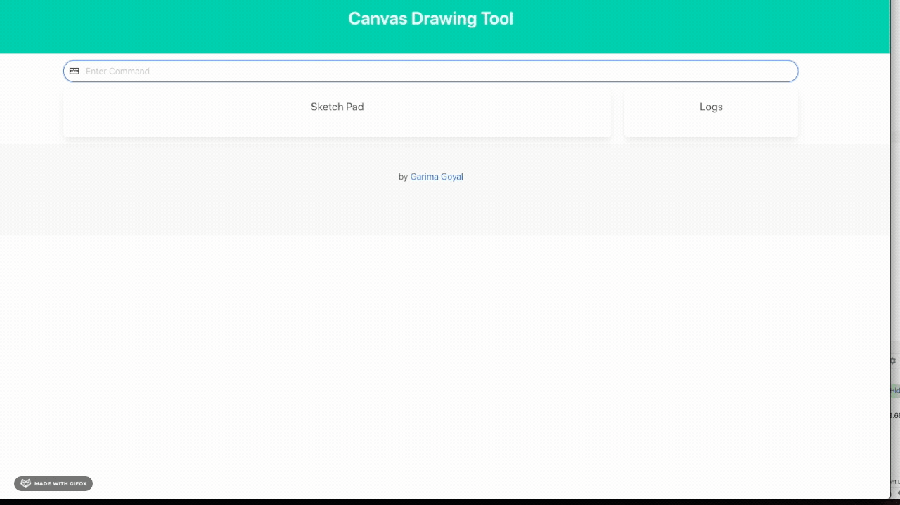

## "Console" Drawing App

A simple Canvas Drawing Tool, with Console like output. 

### Setup 
````
git clone https://github.com/rengarima/react-canvas-drawing.git
yarn install
yarn start
````
Open [http://localhost:3000](http://localhost:3000) to view it in the browser.

### Demo


### Deviations
- A slightly different approach to "console" output - I wanted to use React and instead of console drawing, the drawing tool is on the browser. However, it still has input and output as "Command Like"
- Q (or clear button) will clear the drawing board instead of quitting the program.
- No overwrite functionality


### ADR
- React ^16.13
- Typescript - for better type checks and cleaner code read
- Bulma.io - CSS Framework
- Global State (./store/global.ts & ./hooks/.useStore ) - A simplest form of sharing state with other components and hooks - decided against other implementation ( useContext/persisted state) for now. 
- Flood fill Algo from [here](https://hackernoon.com/flood-fill-algorithm-with-recursive-function-sex3uvz)

### Overview
You're given the task of writing a simple console version of a drawing program. 
At this time, the functionality of the program is quite limited but this might change in the future. 
In a nutshell, the program should work as follows:
 1. Create a new canvas
 2. Start drawing on the canvas by issuing various commands
 3. Quit
 
### Commands
````
Command 		Description
C w h           Should create a new canvas of width w and height h.
L x1 y1 x2 y2   Should create a new line from (x1,y1) to (x2,y2). Currently only
                horizontal or vertical lines are supported. Horizontal and vertical lines
                will be drawn using the 'x' character.
R x1 y1 x2 y2   Should create a new rectangle, whose upper left corner is (x1,y1) and
                lower right corner is (x2,y2). Horizontal and vertical lines will be drawn
                using the 'x' character.
B x y c         Should fill the entire area connected to (x,y) with "colour" c. The
                behavior of this is the same as that of the "bucket fill" tool in paint
                programs.
Q               Should quit the program.
````


### Testing

- Using React Testing Library for Unit Testing
- Using Cypress.io for E2E tests 
- `yarn test` - Runs all tests
- `yarn test -u` - Runs all tests and  updates snapshots
- `yarn e2e` - Runs all e2e tests
- `yarn cypress:open` - Runs e2e tests in watch mode


### Acceptance Criteria
```enter command: C 20 4
----------------------
|                    |
|                    |
|                    |
|                    |
----------------------

enter command: L 1 2 6 2
----------------------
|                    |
|xxxxxx              |
|                    |
|                    |
----------------------

enter command: L 6 3 6 4
----------------------
|                    |
|xxxxxx              |
|     x              |
|     x              |
----------------------

enter command: R 14 1 18 3
----------------------
|             xxxxx  |
|xxxxxx       x   x  |
|     x       xxxxx  |
|     x              |
----------------------

enter command: B 10 3 o
----------------------
|oooooooooooooxxxxxoo|
|xxxxxxooooooox   xoo|
|     xoooooooxxxxxoo|
|     xoooooooooooooo|
----------------------

enter command: Q
````


